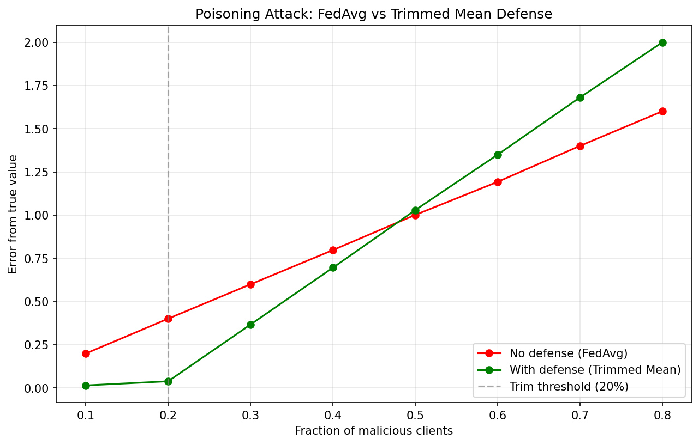

# Federated Learning Poisoning Attack Simulator

A research simulation exploring how poisoning attacks corrupt federated 
learning aggregation, and whether coordinate-wise trimmed mean defense 
can mitigate them.

Motivated by poisoning attack literature in federated learning, including
work on proactive defense mechanisms in distributed AI systems.

## Core Idea

In federated learning, multiple clients train locally and send updates to 
a central server. If some clients are malicious, they can send poisoned 
updates to corrupt the global model, this is called a **poisoning attack**.

This simulator abstracts that threat model down to its mathematical core:
- Honest clients report a true value with natural Gaussian noise
- Malicious clients send manipulated values (label flipping or random noise)
- The aggregator tries to recover the true value using two strategies:
  - FedAvg: the plain average (vulnerable to poisoning)
  - Trimmed Mean: discards extreme values before averaging (robust)

## My Findings



- At 10-20% malicious clients: trimmed mean reduces error by over 90%
- At 30% malicious clients: improvement drops sharply to ~38%, so this is where poisoned votes begin surviving the trim threshold
- At 50% malicious clients: the defense crossover point, trimmed mean 
  becomes counterproductive
- Beyond 50%: trimmed mean actively worsens the result due to over-trimming
  of honest votes

**Takeaway**: the trim parameter (20%) defines a hard Byzantine fault tolerance boundary (Byzantine faults are when nodes in a distributed system send maliciously incorrect information). The defense effectiveness collapses precisely when malicious clients exceed the trim threshold which isa known limitation that motivates 
more adaptive defense mechanisms.

## Architecture
```
clients.py      — honest clients (Gaussian noise) and malicious clients
                  (label flipping, random poisoning)
aggregator.py   — FedAvg baseline and trimmed mean defense
simulation.py   — runs experiment across 100 rounds per configuration
main.py         — varies malicious ratio from 10% to 80%, plots results
```

## Attack Types Modeled

**Label flipping**: A malicious client reports exact negation of true value.
Maps to flipping training labels in real federated learning.

**Random poisoning**: A malicious client sends random value between -10 
and 10. Models a maximally disruptive adversary with no knowledge of the 
true value.

## Defense Mechanism

Coordinate-wise trimmed mean with trim=0.2:
1. Sort all client votes
2. Discard bottom 20% and top 20%
3. Average the remaining middle 60%

Limitation: when malicious clients exceed the trim fraction, poisoned 
votes survive into the average. Future work could explore adaptive trim 
parameters or Byzantine-robust alternatives.

## Setup
```bash
python3 -m venv venv
source venv/bin/activate
pip install numpy matplotlib
python main.py
```
